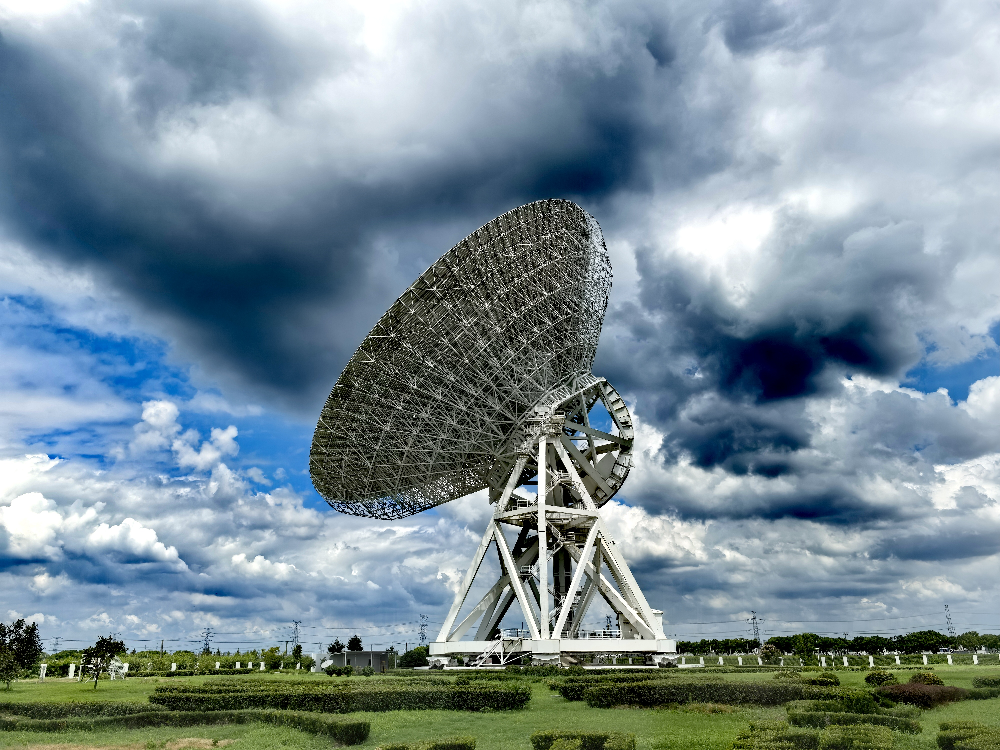
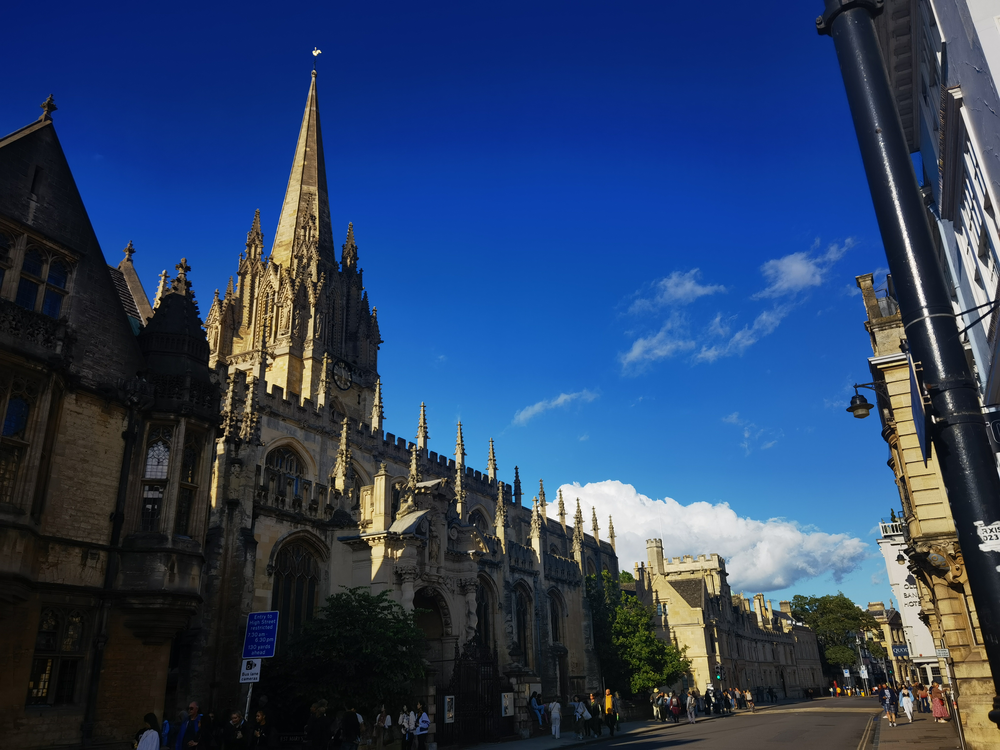
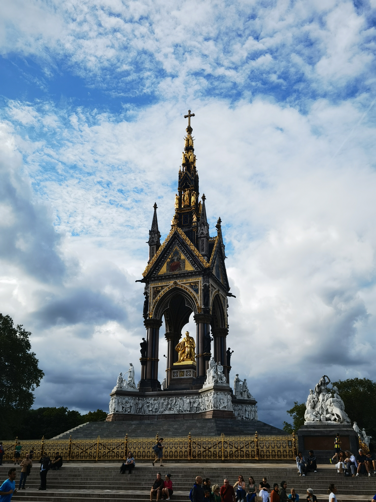
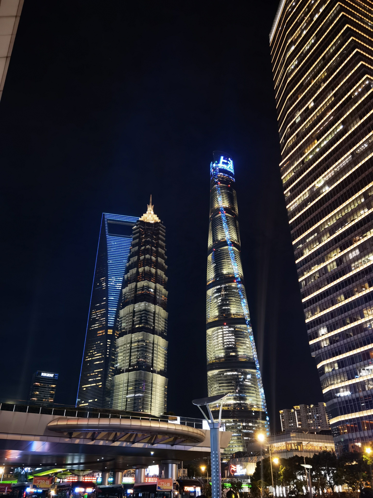

<!--
**alkaline-acid/alkaline-acid** is a ✨ _special_ ✨ repository because its `README.md` (this file) appears on your GitHub profile.

Here are some ideas to get you started:

- 🔭 I’m currently working on ...
- 🌱 I’m currently learning ...
- 👯 I’m looking to collaborate on ...
- 🤔 I’m looking for help with ...
- 💬 Ask me about ...
- 📫 How to reach me: ...
- 😄 Pronouns: ...
- ⚡ Fun fact: ...
-->

# Hi there 👋 

🎓 Undergraduate Student / 🎬 Content creator / 💻 Be fond of cyberspace

## Resume

I'm at <xiaoyangsheep@mail.ustc.edu.cn>, and I'm glad to share my resume with you😎. Just feel free to contact me.

## About Me

I'm a third-year undergraduate student at the [Electric Engineering and Information Science](https://eeis.ustc.edu.cn/), [University of Science and Technology of China](https://ustc.edu.cn/). My research interests include computer vision, circuit designing, machine learning, and network security. I have learned machine learning and network security by myself🎉.

I am very fortunate to be advised by [Prof. Chen Weidong](https://eeis.ustc.edu.cn/2025/0704/c2615a690201/page.htm) of the National Engineering Laboratory for Brain-like Intelligence Technology and Applications from [Electrical & Information Engineering](https://eeis.ustc.edu.cn/), University of Science and Technology of China. 

- 🎓 Undergraduate student at USTC
- ✍️ Self-learned about machine learning and network security
- 🎬 Content creator on  Bilibili.
- ✈️ Traveling lover
- 🏊 Passionate in swimming and got good scores in school sports events.
- 🙏 Certified Red Cross paramedic

## Education

* University of Science and Technology of China (USTC) 		--Sep.2022-Present
  * Electric Engineering and Information Science
  
    
## Study Experience
* Chinese Academy of Sciences 		--Jul. 2024 - Aug. 2024
  * Summer Camp 2024 For Outstanding Students
  
* Xi'an Jiaotong University		--Aug. 2024 - Sep. 2024
  * Summer Institute 2024. Traditional Chinese Cultural
  
* Oriel College of Oxford University 		--Jul. 2023 - Aug. 2023
  * Summer Institute 2023. Quantum Computing
  
    

## Student Work Experience
* School Student Alumni Public Welfare Club 		--Sep. 2023 - Present
  * President
  
* Teaching assistant		--Sep. 2024 - Jan. 2025
  * Stochastic process teaching assistant
  
* Class 2204 Youth League Committee		--Sep. 2023 - Present
  * Youth League Branch Secretary
  
    

## Honors and Awards
| Honors and Awards | Date |
|--------------------|----------|
|        Huawei Scholarship(Top 5%)        |  Oct.2024        |
| Outstanding Student Cadre | Jun. 2024 |
| Outstanding Core Members for Student Clubs | May.2024 |
| USTC Fellowship Undergraduate A-Class Funding (Top 5%) | Dec.2023 |

more in my CV... :relaxed:

## Skills

 - Programming: C/C++, Matlab, Python, Verilog, LateX, KaliOS(Linux)
 - Software: Mathematica, Matlab, Origin, Photoshop, Quartus, Docker, Hyper-V, wireshark(Well, I don't know if this really count)
 - Language: Chinese(Both Simplified and Traditional), English

## Connect

- [Github: alkaloid-acid](https://github.com/alkaloid-acid)
- [Mail: xiaoyangsheep@mail.ustc.edu.cn](mailto:xiaoyangsheep@mail.ustc.edu.cn)

## Gallery

  
 

- 
- 

